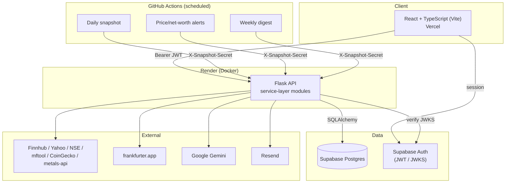

# Net Worth Tracker

[](https://github.com/nishmethuku/networth-tracker/actions/workflows/ci.yml)
[](#license)

A full-stack family net worth tracker: real transaction-based portfolio accounting (FIFO/LIFO/average cost basis, realized/unrealized gains, XIRR), liabilities and true net worth, ten asset types across multiple countries and currencies, household sharing with editor/viewer roles, broker CSV import, price alerts, benchmark comparison, a weekly email digest, auto-detected net worth milestones, and an optional Gemini-powered AI copilot.

## Stack

- **Frontend**: React 18, TypeScript (incremental — API layer + utils are `.ts`; components are `.jsx`, converting one at a time), Vite (route-level code-splitting + PWA plugin), React Router, TanStack Query, Recharts, framer-motion, react-hook-form + zod, react-i18next
- **Backend**: Flask, SQLAlchemy, Flask-Migrate (Alembic), Flask-Limiter
- **Database & Auth**: Supabase (Postgres + Auth — email/password and Google OAuth)
- **AI**: Google Gemini, chosen for its free tier (copilot chat, AI-narrated digest, allocation advisor, transaction categorizer, spreadsheet/bank-statement import, natural-language search) — fully optional, degrades to a clean "not configured" response (or a friendly quota-exceeded message) without ever hard-failing a request
- **Live/historical prices**: Finnhub (US live), Yahoo Finance (historical + NSE fallback, unofficial/keyless), NSE libraries + mftool (India), CoinGecko (crypto), metals-api.com (gold/silver/platinum), frankfurter.app (FX)
- **Email**: Resend (weekly digest, price alerts, milestone celebrations)
- **Tooling**: ESLint (flat config, typescript-eslint for `.ts`) + Prettier, `tsc --noEmit` for type checking, pytest + Vitest for unit/component tests, Playwright for real-browser E2E tests (network + auth mocked, no secrets needed), Locust for load testing (see [LOAD_TEST_RESULTS.md](./LOAD_TEST_RESULTS.md)), GitHub Actions CI on every push/PR
- **Observability**: Sentry (optional — `SENTRY_DSN`; unset = no-op, same graceful-degradation pattern as every other integration)
- **Rate limiting**: Redis-backed when `REDIS_URL` is set (required for the limit to actually be enforced correctly across gunicorn's 2 worker processes — see [LOAD_TEST_RESULTS.md](./LOAD_TEST_RESULTS.md)), falls back to in-memory otherwise
- **Deployment**: Vercel (frontend) + Render (backend, Docker) + GitHub Actions (daily snapshot, weekly digest, alert-check crons)

## Engineering highlights

A few of the harder problems this project actually had to solve, for anyone skimming past the feature list:

- **Multi-currency aggregation correctness.** Every holding is denominated in its own currency; every aggregate figure (dashboard totals, account/category rollups, tax summaries) has a currency-converted twin (`display_value`, `display_cost_basis`, `display_realized_gain`, ...) computed server-side before summing — summing raw native-currency numbers across a USD holding and an INR holding is a real bug class this codebase specifically guards against and tests for (e.g. a live test asserting ₹83,000 converts to ~$866, not literally `83000`).
- **XIRR, not just simple returns.** Portfolio and per-holding annualized returns use Newton's method with a bisection fallback (`backend/finance.py`) over the full dated cash-flow history (buys, sells, dividends), not a naive CAGR — correct for irregular contribution schedules, SIPs, and partial sells.
- **Selectable tax lot-matching.** The tax summary can compute realized gains via average cost (matching the live dashboard), FIFO, or LIFO — a real lot-matching implementation, not just a label swap, verified live to produce genuinely different taxable gains for the same trades.
- **Timing-safe secret comparison.** Internal cron endpoints compare shared secrets with `hmac.compare_digest`, not `==`, to avoid a timing side-channel.
- **Household RBAC.** Owner/editor/viewer roles, with per-holding privacy flags so a shared household view never leaks a member's private holdings — enforced at the query-scoping layer, not just the UI.
- **Graceful AI degradation.** Every AI-backed route (chat, allocation advisor, search, budget insights, spreadsheet/bank-statement import) distinguishes "not configured," "quota exceeded," and "call failed," and never 500s or blocks a non-AI code path — the app is fully usable with `GEMINI_API_KEY` unset.
- **Cold-start handling.** Render's free tier spins the backend down after 15 minutes idle; the API client detects a cold-start-shaped failure and retries once at a much longer timeout, with a UI toast, instead of just failing the user's first request of the day.

## Architecture



## Features

- Email/password and Google sign-in via Supabase Auth; every user sees only their own data
- **Holdings & transactions**: stocks, mutual funds, crypto, commodities, real estate, fixed deposits, PPF, EPF, cash, loans. Quantity-based types (stock/mutual_fund/crypto/commodity) track a full buy/sell ledger with average-cost basis, realized gains, unrealized gains, dividend/interest income, and per-holding + portfolio-wide XIRR; everything else tracks periodic value updates.
- **Liabilities**: mortgages, credit cards, auto/student/personal loans, lines of credit — subtracted from total assets everywhere (dashboard, daily snapshots, allocation-drift math) to get true net worth, with a per-liability payoff calculator (standard amortization) and an assets-vs-debt trend chart.
- **Multi-currency**: every holding is denominated in its native currency; the dashboard converts to your chosen display currency (USD/INR/AUD) using live FX rates, cached daily, with a currency-exposure breakdown of how much of your net worth sits in each currency
- **Tax summary**: realized gains grouped by financial year (India Apr–Mar, elsewhere calendar year), short-term/long-term split with a rough tax liability estimate, year-over-year comparison, and a selectable cost-basis method (average / FIFO / LIFO) for tax-loss-harvesting scenarios
- **CAGR histogram**: annualized return per individual holding plus the overall portfolio XIRR, at a glance
- **Buy value everywhere**: cost basis / buy value shown at the per-holding, per-account, and portfolio-grand-total level, alongside current value and $ / % gain
- **Goals**: net worth targets with a progress bar; **allocation targets & drift**: save a target allocation, get a drift check against it on every dashboard load; **FIRE calculator**: What-If projection extended with a target FIRE number and the year you'd reach it; **emergency fund**: months of expenses your liquid cash would cover, from existing Budget spending history
- **Milestones**: net worth threshold crossings ($10k, $25k, ..., $100M) are auto-detected from the daily snapshot job — a first-ever snapshot backfills already-passed thresholds quietly, a genuine new crossing gets a one-time celebration
- **Broker CSV import**: Zerodha, Groww (stocks + mutual funds), Fidelity, Robinhood — parsed into a preview you review and confirm before anything is saved
- **AI spreadsheet import** (optional, owner/editor only): upload your own Excel/CSV in whatever layout you already use — Gemini reads it and maps rows to holdings, same review-before-saving flow as broker import
- **Budget**: income/expense tracking with monthly trends and category breakdown — deliberately separate from net worth, so logging a paycheck never touches a holding automatically. Recurring entries (subscriptions, rent, bills) get their own view with next-due dates and a monthly total; optional per-category spending limits with an in-app progress indicator; on-demand AI spending insights; per-member breakdown for a shared household.
- **Bank statement import** (optional, owner/editor only): upload a bank/credit card statement (Excel, CSV, or PDF) — Gemini extracts and categorizes each transaction into your budget, same review-before-saving flow as broker/spreadsheet import
- **Household sharing**: create a household, invite members as editor (can add/edit) or viewer (read-only), holdings can be flagged private to stay out of the shared view entirely
- **Dashboard**: net worth chart (range pills, assets-vs-debt toggle), drill-down allocation donut (type/country/currency), gainers/losers heat-map with sparklines, returns by asset type, net worth vs S&P 500 (SPY) / Nifty 50 (NIFTYBEES) comparison, milestone celebrations, pull-to-refresh on mobile
- **AI copilot** (optional, owner/editor only): floating chat with full portfolio context (streamed), AI-narrated weekly digest, allocation advisor with real rebalance math, transaction tag suggestions, natural-language portfolio search (Cmd+K)
- **Recurring investments (SIP)**: mark a holding as a recurring contribution, see upcoming dates and a projected future value
- **Price alerts**: per-holding price thresholds or net worth thresholds, checked every 4 hours, delivered by email
- **Weekly email digest**: net worth, this week's change, top movers, one-click unsubscribe
- Daily net worth snapshots stored in the database and charted over time
- **Settings**: profile, display currency/language, data export (JSON or a CSV zip), delete-my-data
- Light/dark theme, installable PWA, English/Hindi language toggle, keyboard shortcuts (`?` for the list), full mobile UX (bottom nav, swipe-to-delete, bottom sheets, card layouts, offline indicator)

## Project Structure

```
networth_tracker/
├── backend/
│   ├── app.py                       # Flask routes (auth-scoped, orchestration only)
│   ├── auth.py                      # Supabase JWT verification (JWKS)
│   ├── models.py                    # SQLAlchemy models (Postgres)
│   ├── holdings_service.py          # Cost basis, realized/unrealized gains, XIRR, dashboard aggregation
│   ├── liability_service.py         # Liabilities (debt) — display-currency-converted view
│   ├── emergency_fund_service.py    # Months-of-expenses-covered calculation
│   ├── goal_service.py              # Net worth goals
│   ├── allocation_target_service.py # Saved target allocation
│   ├── allocation_service.py        # Rebalance math (pure, no DB access)
│   ├── milestone_service.py         # Net worth milestone auto-detection
│   ├── price_service.py             # DB-cached current/historical price + FX lookups
│   ├── benchmark_service.py         # Portfolio XIRR vs SPY/NIFTYBEES
│   ├── tax_service.py               # Realized gains by financial year, FIFO/LIFO/average cost basis
│   ├── budget_service.py            # Income/expense aggregation, independent of net worth
│   ├── sip_service.py               # Recurring-contribution date math
│   ├── csv_import_service.py        # Broker CSV parsers (Zerodha/Groww/Fidelity/Robinhood)
│   ├── smart_import_service.py      # AI spreadsheet import
│   ├── bank_import_service.py       # AI bank/credit-card statement import
│   ├── alert_service.py             # Price/net-worth alert evaluation
│   ├── email_service.py             # Resend integration (digest/alert/milestone emails)
│   ├── household_service.py         # Household/invite/membership logic (owner/editor/viewer)
│   ├── snapshot_service.py          # Daily net worth snapshot + milestone detection
│   ├── digest_service.py            # Weekly digest computation + send
│   ├── account_service.py           # Self-service data export / delete-my-data
│   ├── ai_service.py                # Gemini integration, graceful degradation
│   ├── finance.py                   # XIRR (Newton's method + bisection fallback)
│   └── utils.py                     # Live/historical price fetching + in-memory caching
├── frontend/
│   └── src/
│       ├── contexts/                # Auth, Theme, live FX Rates React contexts
│       ├── components/              # Pages: Dashboard, Portfolio, Liabilities, HoldingDetail,
│       │                            #   AddHolding, Transactions, Budget, Insights, TaxSummary, ...
│       ├── api/                     # TypeScript: API client, auth-token attachment, response mapping
│       ├── utils/                   # TypeScript: pure formatting/calculation helpers
│       └── lib/supabaseClient.js
├── supabase/migrations/             # Initial schema + RLS policies (raw SQL, applied once each)
├── migrations/                      # Flask-Migrate/Alembic migrations (schema changes going forward)
└── .github/workflows/               # CI (test/lint/typecheck/build on every push+PR), plus
                                      #   daily snapshot, weekly digest, alert-check crons
```

## Local Setup

See [DEPLOY.md](./DEPLOY.md) for full setup (Supabase project, environment variables) and deployment instructions.

Quick start once `.env` files are filled in:

```bash
# Backend
./start_backend.sh

# Frontend (separate terminal)
cd frontend && npm install && npm run dev
```

### Checks

```bash
# Backend (requirements-dev.txt adds pytest on top of requirements.txt —
# kept separate so the deployed Docker image doesn't carry a test framework)
./backend/venv/bin/pip install -r backend/requirements-dev.txt
./backend/venv/bin/python -m pytest backend/ -q

# Frontend
cd frontend
npm run lint        # ESLint (flat config, TS-aware)
npm run typecheck   # tsc --noEmit
npm run format:check
npx vitest run       # unit/component tests (jsdom)
npm run build
npx playwright install --with-deps chromium   # once
npm run test:e2e    # real-browser E2E (Chromium) — network + Supabase auth mocked, no secrets needed
```

All of the above run in CI on every push and pull request against `main` ([.github/workflows/ci.yml](./.github/workflows/ci.yml)).

## API Overview

All endpoints except `/internal/*` require an `Authorization: Bearer <supabase-access-token>` header. Add `?household_id=<uuid>` to view a shared household's data instead of your own (where supported).

**Holdings & transactions**
- `GET/POST /holdings` (optional `?page=&per_page=` for pagination — omit for the full list), `GET/PUT/DELETE /holdings/:id`
- `GET/POST /holdings/:id/transactions`, `PUT/DELETE /transactions/:id`, `GET /transactions` (global log, filterable, same optional pagination)
- `GET/POST /holdings/:id/valuations`, `DELETE /valuations/:id`
- `GET /holdings/:id/price-history`, `GET /price-lookup`

**Liabilities**
- `GET/POST /liabilities`, `PUT/DELETE /liabilities/:id`

**Dashboard & analysis**
- `GET /dashboard` — net worth (assets minus liabilities), allocation by type/country/currency, gainers/losers, realized/unrealized summary
- `GET /net-worth-history` — real daily snapshot history (assets, liabilities, net worth)
- `GET /benchmark?symbol=SPY|NIFTYBEES.NS` — your XIRR vs the index
- `GET /tax-summary?cost_basis_method=average|fifo|lifo` — realized gains by financial year
- `GET /emergency-fund` — months of expenses your liquid cash covers
- `GET /exchange-rates`

**Goals & allocation targets**
- `GET/POST /goals`, `PUT/DELETE /goals/:id`
- `GET/PUT/DELETE /allocation-targets`, `GET /allocation-drift`

**CSV import**
- `GET /import/brokers`, `POST /import/parse`, `POST /import/confirm`
- `POST /import/smart-parse` (multipart file upload, AI-assisted), `POST /import/smart-confirm`
- `POST /import/bank-statement-parse` (multipart, Excel/CSV/PDF, AI-assisted), `POST /import/bank-statement-confirm`

**Budget (income/expenses, independent of holdings)**
- `GET /budget/categories`, `GET/POST /budget/entries`, `PUT/DELETE /budget/entries/:id`
- `GET /budget/summary?months=N&currency=...` (includes `limit_status` and, for a shared household, `by_member`)
- `GET /budget/subscriptions?currency=...` — recurring entries grouped with next-due dates and a monthly total
- `GET/POST /budget/limits`, `DELETE /budget/limits/:id` — per-category monthly spending limits
- `POST /api/ai/budget-insights` (owner/editor only, requires `GEMINI_API_KEY`) — on-demand spending narrative

**Alerts & milestones**
- `GET/POST /alerts`, `DELETE /alerts/:id`
- `GET /milestones`, `PUT /milestones/:id/acknowledge`

**Households**
- `POST /households`, `GET /households`, `GET /households/:id/members`, `POST /households/:id/invites` (role: editor/viewer), `POST /households/:id/leave`, `DELETE /households/:id/members/:userId`
- `GET /invites`, `POST /invites/:id/accept`

**Symbol search**
- `GET /search-symbols` (stocks/mutual funds), `GET /search-crypto`

**AI (owner/editor only, requires `GEMINI_API_KEY`)**
- `POST /api/ai/chat` — SSE-streamed copilot chat
- `POST /api/ai/allocation-advisor`, `POST /api/ai/search`
- `POST /transactions/:id/suggest-tags`

**Recurring investments (SIP)**
- `GET /holdings/:id/sip-projection?years=N` — upcoming dates + projected future value (SIP fields are set via `PUT /holdings/:id`)

**Account (Settings page)**
- `GET /account/export`, `GET /account/export.zip`, `DELETE /account/data` (body: `{"confirm": "DELETE"}`)
- `GET /price-cache-status`

**Internal (secret-protected, called by GitHub Actions crons)**
- `POST /internal/snapshot`, `POST /internal/weekly-digest`, `POST /internal/check-alerts`, `GET /internal/unsubscribe?token=...`

## License

MIT
